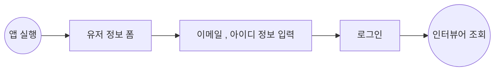
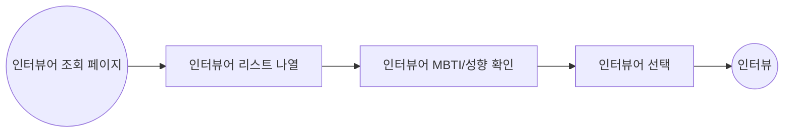
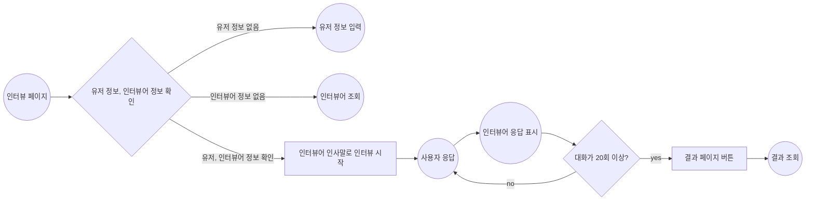
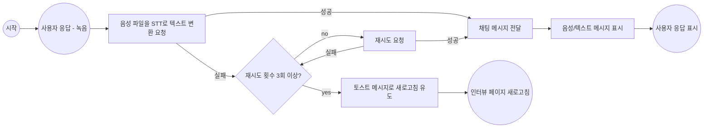
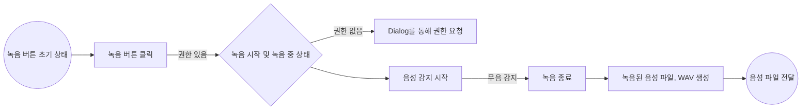
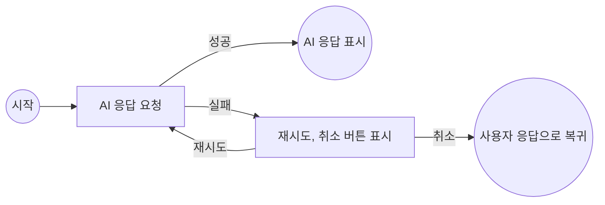
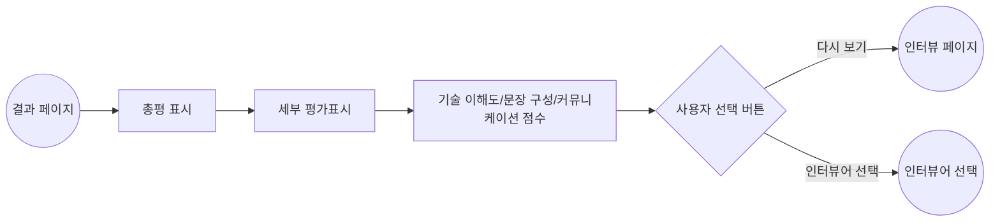

# InterPersona

InterPersona는 개발자들의 이직 준비, 현업에서 면접 연습을 효율적으로 할 수 있도록 돕는 웹 앱입니다.

ChatGPT의 프롬프트를 활용하여 가상의 면접관과 모의 면접을 진행하고, 결과를 점수로 평가 받을 수 있습니다.
또한 녹음을 통해서 답변하여 실제 면접과 같은 경험을 제공합니다.

# Tech Stack

Next.js (v.14) | React (v.18) | TypeScript | Turborepo | Storybook | CSS Modules | MSW | Redux Toolkit | Redux-Saga | Tanstack Query | Zustand | Jest | React Testing Library

# Project Structure

```
├── apps
│   └── frontend
│       ├── public                     # 정적 파일(이미지, 폰트 등)
│       └── src
│           ├── _apis                  # API 호출 로직
│           ├── _components            # 레이아웃/페이지별 컴포넌트
│           │   ├── layout
│           │   └── pages
│           ├── _data                  # 데이터 관련 로직, react-query 훅
│           ├── _hooks                 # 커스텀 훅
│           ├── _mocks                 # Mock 데이터(테스트/개발 환경)
│           ├── _store                 # 프론트엔드 상태(Redux, Zustand)
│           ├── _storybook             # 프론트엔드 앱 전용 스토리북
│           ├── _tests                 # 프론트엔드 앱 전용 테스트
│           └── app                    # Next.js App Router 구조
│               ├── api
│               │   └── chat
│               │       └── route.ts   # STT API 프록시 라우트 등 서버 로직
│               ├── chat
│               │   ├── layout.tsx
│               │   ├── page.module.css
│               │   └── page.tsx       # 채팅(인터뷰) 페이지
│               ...
│               ├── layout.tsx
│               └── page.tsx
├── packages
│   ├── store                          # 전역 상태, Hooks 관리 (ex: useToastStore 등)
│   ├── eslint-config                  # 공통 ESLint 설정
│   ├── typescript-config              # 공통 TypeScript 설정
│   └── ui                             # 공통 UI 컴포넌트
│       └── src                       # 버튼, 모달 등 재사용 컴포넌트와 스토리북
│           └── style                 # 글로벌 스타일 테마
└── turbo.json                         # Turborepo 설정
```

# Flow Chart

## 유저 정보 입력



## 인터뷰어 조회



## 인터뷰

### 인터뷰 전체



### 사용자 응답



### 사용자 응답 - 녹음



### 인터뷰어 응답



## 인터뷰 결과



# [이슈(Wiki)](https://github.com/hmy751/inter-persona/wiki/Issue)

