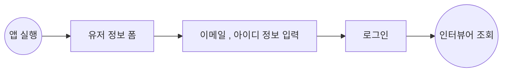
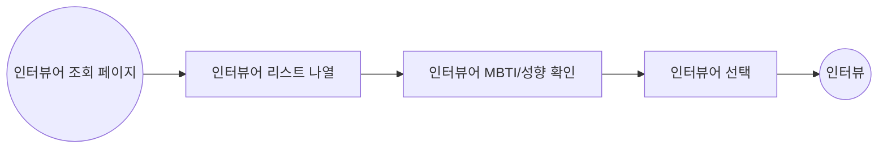
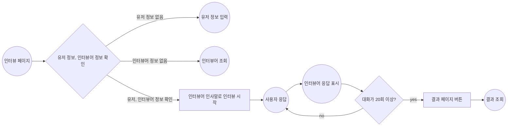
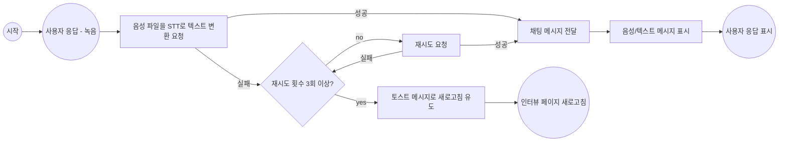
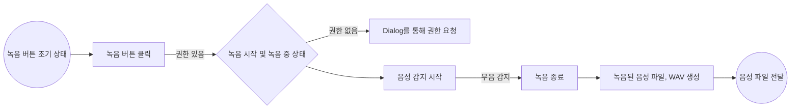
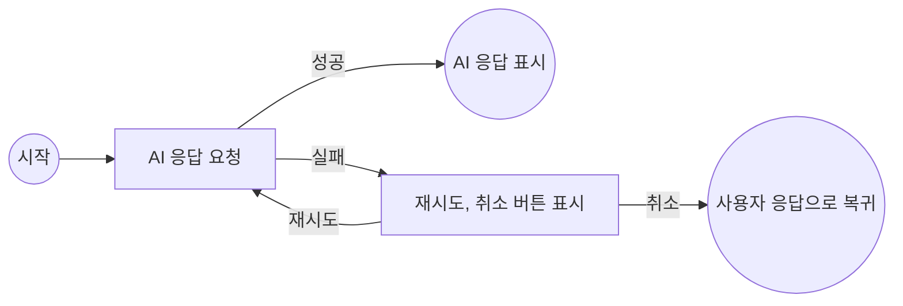
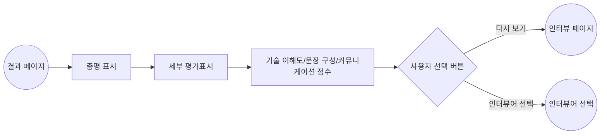

# InterPersona

InterPersona는 개발자들의 이직 준비, 현업에서 면접 연습을 효율적으로 할 수 있도록 돕는 웹 앱입니다.

ChatGPT의 프롬프트를 활용하여 가상의 면접관과 모의 면접을 진행하고, 결과를 점수로 평가 받을 수 있습니다.
또한 녹음을 통해서 답변하여 실제 면접과 같은 경험을 제공합니다.

# Tech Stack

Next.js (v.14) | React (v.18) | TypeScript | Turborepo | Storybook | CSS Modules | MSW | Redux Toolkit | Redux-Saga | Tanstack Query | Zustand | Jest | React Testing Library

# Project Structure

```
├── apps
│   └── frontend
│       ├── public                     # 정적 파일(이미지, 폰트 등)
│       └── src
│           ├── _apis                  # API 호출 로직
│           ├── _components            # 레이아웃/페이지별 컴포넌트
│           │   ├── layout
│           │   └── pages
│           ├── _data                  # 데이터 관련 로직, react-query 훅
│           ├── _hooks                 # 커스텀 훅
│           ├── _mocks                 # Mock 데이터(테스트/개발 환경)
│           ├── _store                 # 프론트엔드 상태(Redux, Zustand)
│           ├── _storybook             # 프론트엔드 앱 전용 스토리북
│           ├── _tests                 # 프론트엔드 앱 전용 테스트
│           └── app                    # Next.js App Router 구조
│               ├── api
│               │   └── chat
│               │       └── route.ts   # STT API 프록시 라우트 등 서버 로직
│               ├── chat
│               │   ├── layout.tsx
│               │   ├── page.module.css
│               │   └── page.tsx       # 채팅(인터뷰) 페이지
│               ...
│               ├── layout.tsx
│               └── page.tsx
├── packages
│   ├── store                          # 전역 상태, Hooks 관리 (ex: useToastStore 등)
│   ├── eslint-config                  # 공통 ESLint 설정
│   ├── typescript-config              # 공통 TypeScript 설정
│   └── ui                             # 공통 UI 컴포넌트
│       └── src                       # 버튼, 모달 등 재사용 컴포넌트와 스토리북
│           └── style                 # 글로벌 스타일 테마
└── turbo.json                         # Turborepo 설정
```

# Flow Chart

## 유저 정보 입력



## 인터뷰어 조회



## 인터뷰

### 인터뷰 전체



### 사용자 응답



### 사용자 응답 - 녹음



### 인터뷰어 응답



## 인터뷰 결과



# Challenge

## Redux-Saga를 활용한 복잡한 채팅 상태 관리를 안정적이고 직관적인 사용자 경험 제공하기

[(Wiki)](https://github.com/hmy751/inter-persona/wiki/Challenge#redux-saga%EB%A5%BC-%ED%99%9C%EC%9A%A9%ED%95%9C-%EB%B3%B5%EC%9E%A1%ED%95%9C-%EC%B1%84%ED%8C%85-%EC%83%81%ED%83%9C-%EA%B4%80%EB%A6%AC%EB%A5%BC-%EC%95%88%EC%A0%95%EC%A0%81%EC%9D%B4%EA%B3%A0-%EC%A7%81%EA%B4%80%EC%A0%81%EC%9D%B8-%EC%82%AC%EC%9A%A9%EC%9E%90-%EA%B2%BD%ED%97%98-%EC%A0%9C%EA%B3%B5%ED%95%98%EA%B8%B0-posting)
[(Posting)](https://medium.com/@hmy751/f-ton-%ED%95%B4%EC%BB%A4%ED%86%A4-%ED%9B%84%EA%B8%B0-interpersona-%ED%94%84%EB%A1%9C%EC%A0%9D%ED%8A%B8-%EA%B0%9C%EB%B0%9C%EA%B8%B0-ec58cb3cc7f8#:~:text=Redux%2DSaga%EB%A5%BC%20%ED%99%9C%EC%9A%A9%ED%95%9C%20%ED%94%84%EB%A1%AC%ED%94%84%ED%8A%B8%20%EB%8C%80%ED%99%94%20%EC%83%81%ED%83%9C%20%EA%B4%80%EB%A6%AC)

## 인터뷰 과정의 자연스러운 흐름을 위한 예외 처리 전략 구현

[(Wiki)](https://github.com/hmy751/inter-persona/wiki/Challenge#%EC%9D%B8%ED%84%B0%EB%B7%B0-%EA%B3%BC%EC%A0%95%EC%9D%98-%EC%9E%90%EC%97%B0%EC%8A%A4%EB%9F%AC%EC%9A%B4-%ED%9D%90%EB%A6%84%EC%9D%84-%EC%9C%84%ED%95%9C-%EC%98%88%EC%99%B8-%EC%B2%98%EB%A6%AC-%EC%A0%84%EB%9E%B5-%EA%B5%AC%ED%98%84posting)
[(Posting)](https://medium.com/@hmy751/%EC%9E%90%EC%97%B0%EC%8A%A4%EB%9F%AC%EC%9A%B4-%EC%82%AC%EC%9A%A9%EC%9E%90-%EA%B2%BD%ED%97%98%EC%9D%84-%EC%A0%9C%EA%B3%B5%ED%95%98%EA%B8%B0-%EC%9C%84%ED%95%9C-%EC%9D%B8%ED%84%B0%EB%B7%B0-%ED%94%84%EB%A1%9C%EC%84%B8%EC%8A%A4%EC%9D%98-%EC%98%88%EC%99%B8%EC%B2%98%EB%A6%AC-%EC%A0%84%EB%9E%B5-34fba16bdf9c)

## 확장 가능한 컴포넌트 아키텍처 설계 및 모노레포 구조화

[(Wiki)](https://github.com/hmy751/inter-persona/wiki/Challenge#%ED%99%95%EC%9E%A5-%EA%B0%80%EB%8A%A5%ED%95%9C-%EC%BB%B4%ED%8F%AC%EB%84%8C%ED%8A%B8-%EC%95%84%ED%82%A4%ED%85%8D%EC%B2%98-%EC%84%A4%EA%B3%84-%EB%B0%8F-%EB%AA%A8%EB%85%B8%EB%A0%88%ED%8F%AC-%EA%B5%AC%EC%A1%B0%ED%99%94-posting)
[(Posting)](https://medium.com/@hmy751/%ED%99%95%EC%9E%A5%EA%B0%80%EB%8A%A5%ED%95%9C-%EC%BB%B4%ED%8F%AC%EB%84%8C%ED%8A%B8-%EC%84%A4%EA%B3%84-a91326f09481)

# Issue

## 브라우저 보안 정책에 따른 STT API CORS 이슈 해결

[(Wiki)](https://github.com/hmy751/inter-persona/wiki/Issue#%EB%B8%8C%EB%9D%BC%EC%9A%B0%EC%A0%80-%EB%B3%B4%EC%95%88-%EC%A0%95%EC%B1%85%EC%97%90-%EB%94%B0%EB%A5%B8-stt-api-cors-%EC%9D%B4%EC%8A%88-%ED%95%B4%EA%B2%B0posting)
[(Posting)](https://medium.com/@hmy751/f-ton-%ED%95%B4%EC%BB%A4%ED%86%A4-%ED%9B%84%EA%B8%B0-interpersona-%ED%94%84%EB%A1%9C%EC%A0%9D%ED%8A%B8-%EA%B0%9C%EB%B0%9C%EA%B8%B0-ec58cb3cc7f8#:~:text=STT%20API%20%EC%9A%94%EC%B2%AD%2C%20CORS%20%EC%97%90%EB%9F%AC%20%EB%B0%9C%EC%83%9D)

## 녹음된 음성파일의 형태 변환 이슈 해결

[(Wiki)](https://github.com/hmy751/inter-persona/wiki/Issue#%EB%85%B9%EC%9D%8C%EB%90%9C-%EC%9D%8C%EC%84%B1%ED%8C%8C%EC%9D%BC%EC%9D%98-%ED%98%95%ED%83%9C-%EB%B3%80%ED%99%98-%EC%9D%B4%EC%8A%88-%ED%95%B4%EA%B2%B0posting)
[(Posting)](https://medium.com/@hmy751/f-ton-%ED%95%B4%EC%BB%A4%ED%86%A4-%ED%9B%84%EA%B8%B0-interpersona-%ED%94%84%EB%A1%9C%EC%A0%9D%ED%8A%B8-%EA%B0%9C%EB%B0%9C%EA%B8%B0-ec58cb3cc7f8#:~:text=%7D%0A%20%20%7D%0A%7D-,%EC%9D%8C%EC%84%B1%20%EB%85%B9%EC%9D%8C%2C%20%ED%8C%8C%EC%9D%BC%20%ED%8F%AC%EB%A7%B7%20%EC%97%90%EB%9F%AC,-MediaRecorder%20API%EB%A5%BC)

## 테스트 환경 개선 및 Jest/MSW 목킹 이슈와 해결법

[(Wiki)](https://github.com/hmy751/inter-persona/wiki/Issue#%ED%85%8C%EC%8A%A4%ED%8A%B8-%ED%99%98%EA%B2%BD-%EA%B0%9C%EC%84%A0-%EB%B0%8F-jestmsw-%EB%AA%A9%ED%82%B9-%EC%9D%B4%EC%8A%88%EC%99%80-%ED%95%B4%EA%B2%B0%EB%B2%95posting)
[(Posting)](https://medium.com/@hmy751/%ED%85%8C%EC%8A%A4%ED%8A%B8-%ED%99%98%EA%B2%BD-%EA%B0%9C%EC%84%A0%EA%B8%B0-jest-msw-%EB%AA%A9%ED%82%B9-%EC%9D%B4%EC%8A%88%EC%99%80-%ED%95%B4%EA%B2%B0%EB%B2%95-3f51a0fd9dca)

## Next.js 14 환경에서의 MSW 서비스 워커 등록 및 오류

[(Wiki)](https://github.com/hmy751/inter-persona/wiki/Issue#nextjs-14-%ED%99%98%EA%B2%BD%EC%97%90%EC%84%9C%EC%9D%98-msw-%EC%84%9C%EB%B9%84%EC%8A%A4-%EC%9B%8C%EC%BB%A4-%EB%93%B1%EB%A1%9D-%EB%B0%8F-%EC%98%A4%EB%A5%98posting)
[(Posting)](https://medium.com/@hmy751/%ED%85%8C%EC%8A%A4%ED%8A%B8-%ED%99%98%EA%B2%BD-%EA%B0%9C%EC%84%A0%EA%B8%B0-jest-msw-%EB%AA%A9%ED%82%B9-%EC%9D%B4%EC%8A%88%EC%99%80-%ED%95%B4%EA%B2%B0%EB%B2%95-3f51a0fd9dca#:~:text=%EC%9D%B4%EC%8A%88%205%3A%20MSW%EC%99%80%20Next.js%2014%20%ED%98%B8%ED%99%98%20%EB%AC%B8%EC%A0%9C)

## Turborepo 기반 모노레포 환경의 패키지 의존성 문제

[(Wiki)](https://github.com/hmy751/inter-persona/wiki/Issue#turborepo-%EA%B8%B0%EB%B0%98-%EB%AA%A8%EB%85%B8%EB%A0%88%ED%8F%AC-%ED%99%98%EA%B2%BD%EC%9D%98-%ED%8C%A8%ED%82%A4%EC%A7%80-%EC%9D%98%EC%A1%B4%EC%84%B1-%EB%AC%B8%EC%A0%9C)
