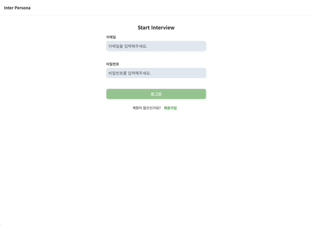
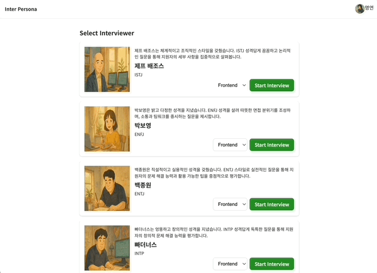
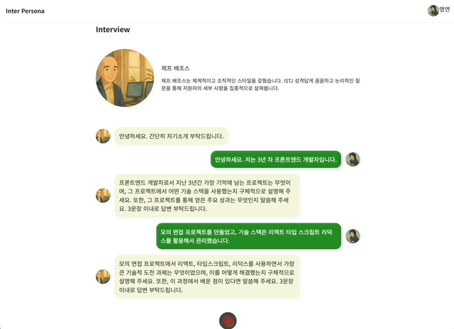
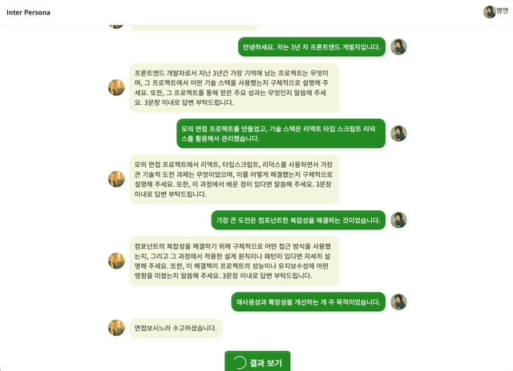
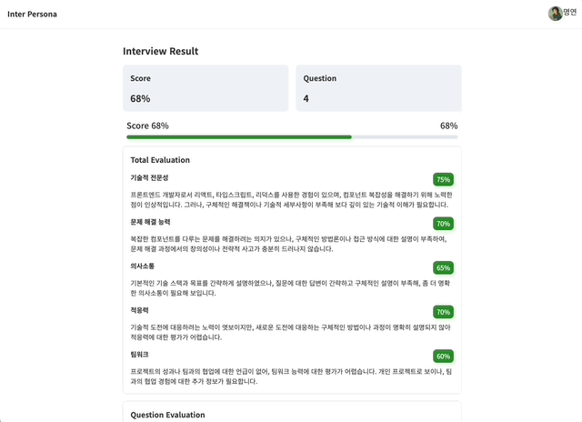
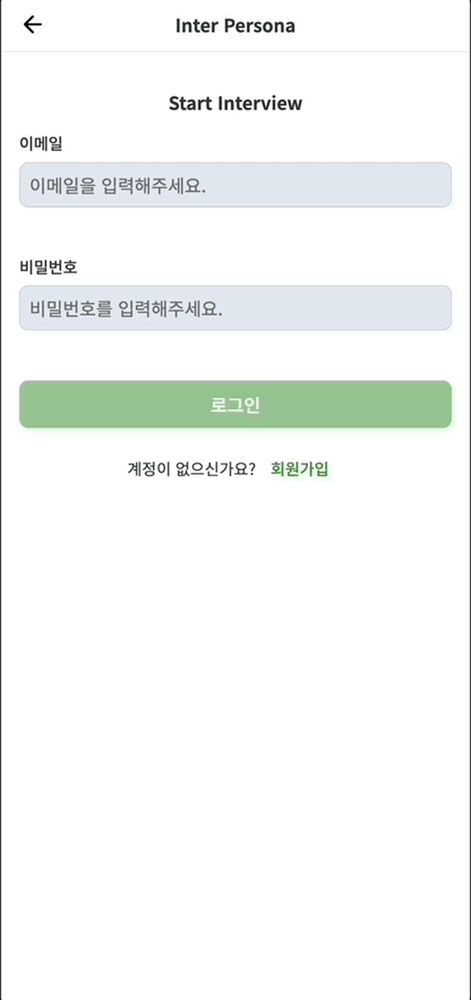
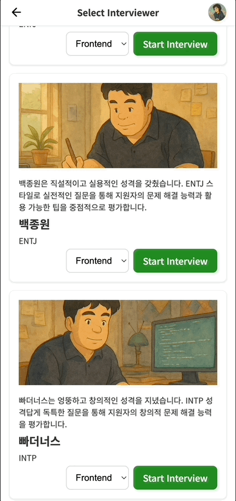
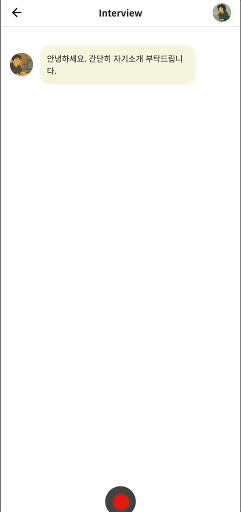
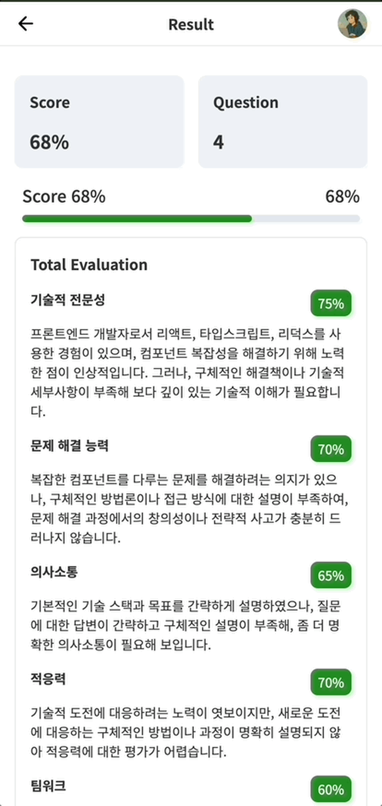

<p align="center">
  
  <h1 align="center">Inter Persona</h1>
</p>

<p align="center">
  <a href="https://inter-persona.com" target="_blank">
    
  </a>
  
  
</p>

# 🎙️ 소개

Inter Persona는 개발자들이 실제 면접처럼 연습하고, AI 면접관으로부터 피드백을 받아 이직 및 현업 면접 준비를 효율적으로 할 수 있도록 돕는 웹 애플리케이션입니다.
Grok의 프롬프트를 활용하여 가상 면접관과 실시간으로 모의 면접을 진행하고, 답변은 음성 녹음을 통해 전달하여 실제 면접과 유사한 경험을 제공합니다.
면접 후에는 답변 내용에 대한 점수와 상세 피드백도 받을 수 있습니다.

# 📖 목차

- [🎙️ 소개](#-소개)
- [🔥 프로젝트 동기](#-프로젝트-동기)
- [🏗️ 프로젝트 구조](#-프로젝트-구조)
- [🚀 시작하기](#-시작하기)
  - [1. 준비 단계](#1-준비-단계)
  - [2. 데이터베이스](#2-데이터베이스)
  - [3. 개발 서버](#3-개발-서버)
  - [4. 빌드 및 프로덕션 서버](#4-빌드-및-프로덕션-서버)
- [✨ 주요 기능](#-주요-기능)
- [🌊 전체 흐름](#-전체-흐름)
- [⚙️ 기술 스택](#-기술-스택)
- [🔗 기타](#-기타)

# 🔥 프로젝트 동기

개발자에게 면접 준비는 종종 부담으로 다가오며, 실제와 유사한 환경에서 효과적으로 연습할 기회는 제한적입니다.
특히 기술 면접에서는 단순한 지식 전달을 넘어, 자신의 생각을 논리적으로 전달하고 면접관과 원활하게 소통하는 역량이 요구됩니다.
그러나 일반적인 면접 준비 방식은 개인이 예상 질문에 답변을 준비하거나 스터디를 통해 단편적인 피드백을 받는 수준에 머무르는 경우가 많았습니다.

Inter Persona는 이러한 문제에 대한 인식을 바탕으로, 개발자들이 겪는 어려움을 해결하고자 시작되었습니다.
다음과 같은 핵심적인 필요를 충족시키는 솔루션을 목표로 삼았습니다:

1. 실제 면접과 유사한 환경에서 실전 감각을 기를 수 있는 연습 기회 제공
2. 답변 내용에 대한 객관적이고 즉각적인 분석 및 피드백 지원
3. 시간과 장소의 제약 없이 면접 역량을 체계적으로 향상시킬 수 있는 효율적인 방안 마련

이러한 목표를 가지고, 약 1주일간의 해커톤 기간 동안 핵심 기능 중심의 프로토타입을 신속히 개발하며 Inter Persona 프로젝트의 필수 기능을 구현했습니다.
초기에는 팀 프로젝트로 시작되었으나, 이후 개인적으로 프로젝트를 발전시켜 실제 서비스 출시를 목표로 개발을 이어왔습니다.
현업 수준의 개발 환경을 구축하고 사용자 중심의 기능을 심화하는 과정을 통해, 단순한 모의 면접 도구를 넘어 개발자들이 면접을 경험할 수 있도록 돕는 플랫폼을 구현하고자 노력했습니다.

# 🏗️ 프로젝트 구조

```
├── apps
│ ├── frontend
│ │ ├── public                                 # 정적 파일(이미지, 폰트 등)
│ │ ├── src
│ │ │ ├── _apis                                # API 호출 로직
│ │ │ ├── _components                          # 레이아웃/페이지별 컴포넌트
│ │ │ ├── _data                                # 데이터 관련 로직, react-query 훅
│ │ │ ├── _hooks                               # 커스텀 훅
│ │ │ ├── _libs                                # 라이브러리, 유틸 함수
│ │ │ ├── _mocks                               # Mock 데이터(테스트/개발 환경)
│ │ │ ├── _store                               # 프론트엔드 상태(Redux, Zustand)
│ │ │ ├── _storybook                           # 프론트엔드 앱 전용 스토리북
│ │ │ ├── _tests                               # 프론트엔드 앱 전용 테스트
│ │ │ ├── app                                  # Next.js App Router 구조
│ │ │ │ ├── api                                # API 라우트
│ │ │ │ ├── interview                          # 인터뷰 페이지
│ │ │ │ ├── interviewer                        # 인터뷰어 선택 페이지
│ │ │ │ ├── result                             # 결과 페이지
│ │ │ │ ├── user                               # 사용자 정보 페이지
│ │ │ │ ├── global-error.tsx
│ │ │ │ ├── layout.tsx
│ │ │ │ └── page.tsx
│ │ │ ...
│ └── backend
│ ├── prisma                                   # 데이터 베이스
│ ├── src                                      # 백엔드 서버
│ │ ├── routes
│ │ └── service
│ │ ...
│ ...
├── packages
│ ├── constant                                 # 공통 상수
│ ├── eslint-config                            # 공통 ESLint 설정
│ ├── schema                                   # 데이터 유효성 검사 스키마(Zod)
│ ├── store                                    # 전역 상태, Hooks 관리
│ ├── storybook-config                         # 공통 Storybook 설정
│ ├── testing-config                           # 공통 테스트 설정
│ ├── typescript-config                        # 공통 TypeScript 설정
│ ├── ui                                       # 공통 UI 컴포넌트
│ └── utils                                    # 공통 유틸리티 함수
└── turbo.json                                 # Turborepo 설정

```

# 🚀 시작하기

## 1. 준비 단계

의존성 설치:

```Bash
npm install -g pnpm
```

```Bash
pnpm install
```

## 2. 데이터베이스

(백엔드용 .env 파일에 DATABASE_URL 설정 확인)

마이그레이션 실행:

```Bash
turbo run prisma:generate
```

## 3. 개발 서버

백엔드 (8000):

```Bash
turbo run dev:backend
```

프론트엔드 (3000):

```Bash
turbo run dev:frontend
```

API 모킹(MSW) 사용 시:

```Bash
turbo run dev:frontend:msw
```

## 4. 빌드 및 프로덕션 서버

프로젝트 빌드

```Bash
turbo run build
```

백엔드 (8000):

```Bash
turbo run start:backend
```

프론트엔드 (3000):

```Bash
turbo run start:frontend
```

# ✨ 주요 기능

🤖 AI 면접관과의 실시간 모의 면접: Grok을 기반으로 한 가상 면접관이 실제 면접처럼 질문을 던집니다.

🎤 음성 답변 및 STT(Speech-to-Text) 변환: 마이크를 통해 음성으로 답변하면, STT 기술이 텍스트로 변환하여 면접관에게 전달합니다. 실제 대화하듯 면접 연습이 가능합니다.

📊 면접 결과 점수화 및 상세 피드백: 면접이 끝나면 총평, 기술 이해도, 문장 구성력, 커뮤니케이션 능력 등을 종합적으로 평가하여 점수로 보여주고, 개선을 위한 피드백을 제공합니다.

👔 다양한 성향의 면접관 선택: 면접관의 MBTI나 성향을 미리 확인하고 선택하여, 다양한 유형의 면접에 대비할 수 있습니다.

# 🌊 전체 흐름

Inter Persona의 사용 흐름은 간단합니다.

사용자 정보 입력: 앱 실행 후, 이메일과 아이디를 입력하여 로그인합니다.



인터뷰어 조회: 다양한 성향의 가상 면접관 리스트를 확인하고, 마음에 드는 면접관을 선택합니다.



인터뷰 진행: 선택한 면접관의 인사말로 인터뷰가 시작됩니다. 사용자는 음성으로 답변하고, AI 면접관의 후속 질문에 응답하며 대화를 이어갑니다.



결과 확인: 약 20회의 대화가 오가면 인터뷰가 마무리되고, 결과 페이지에서 종합 점수와 세부 평가를 확인할 수 있습니다.

<div style="display: flex; justify-content: flex-start; align-items: flex-start;">
  
  
</div>

추가로 모바일에서도 볼 수 있도록 반응형 UI로 구현했습니다.

<div style="display: flex; justify-content: flex-start; align-items: flex-start; flex-wrap: wrap;">
  
  
  
  
</div>

이 모든 과정은 실제 면접 경험을 최대한 살릴 수 있도록 설계되었습니다.

# ⚙️ 기술 스택

언어: TypeScript, Javascript

프레임워크: Next.js, React

상태 관리: Redux-Saga, Tanstack Query, Zustand

개발 도구: Turborepo, Storybook, MSW

스타일링: CSS Modules

서버 및 데이터 베이스: Node.js, Express, Prisma

테스팅: Jest, React Testing Library

배포 CI/CD: AWS

라이브러리: Zod

# 🔗 기타

이외 프로젝트의 이슈, 플로우 차트 등의 기타 항목들은 Wiki에서 확인할 수 있습니다.
