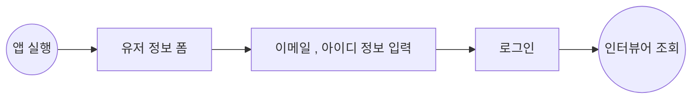
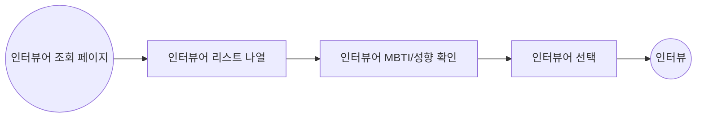
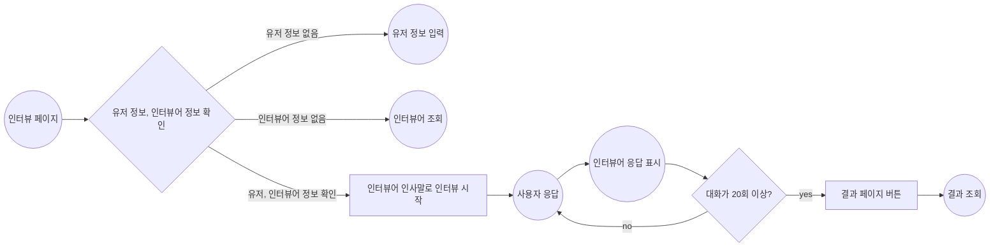
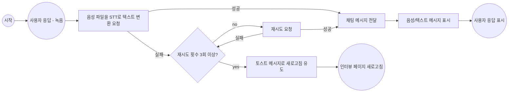
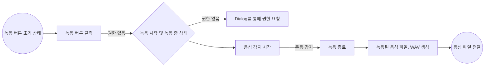
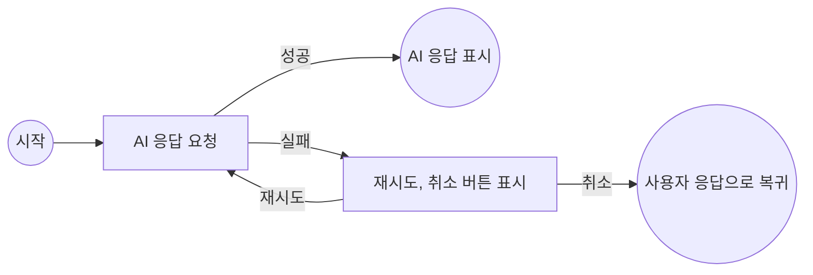
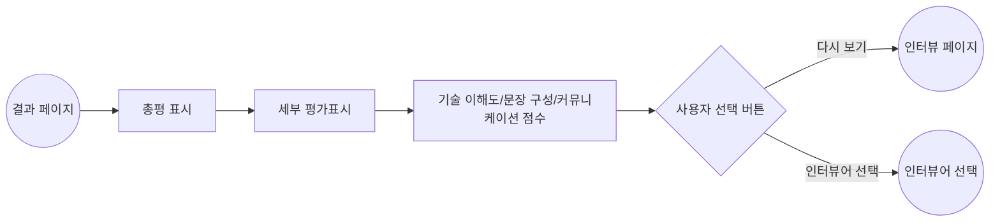

# InterPersona

InterPersona는 개발자들의 이직 준비, 현업에서 면접 연습을 효율적으로 할 수 있도록 돕는 웹 앱입니다.

ChatGPT의 프롬프트를 활용하여 가상의 면접관과 모의 면접을 진행하고, 결과를 점수로 평가 받을 수 있습니다.
또한 녹음을 통해서 답변하여 실제 면접과 같은 경험을 제공합니다.

# Tech Stack

Next.js (v.14) | React (v.18) | TypeScript | Turborepo | Storybook | CSS Modules | MSW | Redux Toolkit | Redux-Saga | Zustand | Jest | React Testing Library

# Project Structure

```
├── apps
│   └── frontend
│       ├── public                     # 정적 파일(이미지, 폰트 등)
│       └── src
│           ├── _apis                  # API 호출 로직
│           ├── _components            # 레이아웃/페이지별 컴포넌트
│           │   ├── layout
│           │   └── pages
│           ├── _hooks                 # 커스텀 훅
│           ├── _mocks                 # Mock 데이터(테스트/개발 환경)
│           ├── _store                 # 프론트엔드 상태(Redux, Zustand)
│           ├── _storybook             # 프론트엔드 앱 전용 스토리북
│           ├── _tests                 # 프론트엔드 앱 전용 테스트
│           └── app                    # Next.js App Router 구조
│               ├── api
│               │   └── chat
│               │       └── route.ts   # STT API 프록시 라우트 등 서버 로직
│               ├── chat
│               │   ├── layout.tsx
│               │   ├── page.module.css
│               │   └── page.tsx       # 채팅(인터뷰) 페이지
│               ...
│               ├── layout.tsx
│               └── page.tsx
├── packages
│   ├── store                          # 전역 상태, Hooks 관리 (ex: useToastStore 등)
│   ├── eslint-config                  # 공통 ESLint 설정
│   ├── typescript-config              # 공통 TypeScript 설정
│   └── ui                             # 공통 UI 컴포넌트
│       └── src                       # 버튼, 모달 등 재사용 컴포넌트와 스토리북
│           └── style                 # 글로벌 스타일 테마
└── turbo.json                         # Turborepo 설정
```

# Flow Chart

## 유저 정보 입력



## 인터뷰어 조회



## 인터뷰

### 인터뷰 전체



### 사용자 응답



### 사용자 응답 - 녹음



### 인터뷰어 응답



## 인터뷰 결과



# 이슈

## 브라우저 보안 정책에 따른 STT API CORS 이슈 해결

프로젝트에서 녹음으로 답변을 응답하는 기능이 있어 음성파일을 텍스트로 변환하는 과정이 필요했습니다.

그래서 네이버 STT API를 통해서 오디오 파일을 텍스트로 변환하여 해당 기능을 구현하려고 했는데, 백엔드 개발 리소스가 부족한 상황으로 프론트에서 기능을 구현하려고 했습니다.

하지만 클라이언트 사이드에서 요청을 시도했으나 CORS 에러가 발생했고 클라이언트 사이드 요청을 지원하지 않는다고 판단해, Next js의 route handler를 통해 서버로 우회하여 요청을 했고 문제를 해결했습니다.

```tsx
// app/api/chat/route.ts

const CLIENT_SECRET = process.env.NEXT_PUBLIC_CLIENT_SECRET as string;
const INVOKE_URL = process.env.NEXT_PUBLIC_INVOKE_URL as string;
export async function POST(req: Request) {
  try {
    const formData = await req.formData();
    const response = await fetch(`${INVOKE_URL}/recognizer/upload`, {
      method: "POST",
      headers: {
        "X-CLOVASPEECH-API-KEY": CLIENT_SECRET,
      },
      body: formData,
    });
    if (!response.ok) {
      throw new Error("STT API request failed");
    }
    const data = await response.json();
    return new Response(JSON.stringify(data), { status: 200 });
  } catch (error: unknown) {
    if (error instanceof Error) {
      return new Response(error.message, { status: 500 });
    }
  }
}
```

## Redux-Saga를 활용한 복잡한 채팅 상태 관리를 안정적이고 직관적인 사용자 경험 제공하기

인터뷰 프로세스 중 채팅 기능은 비동기 로직이 복잡하게 얽혀 있고 또 흐름을 일관적으로 제어하는게 중요하다고 판단했습니다.

그래서 채팅 상태관리와 관련 비동기 요청을 일정한 흐름으로 같이 구현할 수 있도록 Redux-Saga를 활용하여 구현했습니다.

Redux-Saga로 구현한 결과 인터뷰 시나리오를 부드럽게 이어지도록 구현할 수 있고 또 로직을 체계화 하며 추후 관련 기능 확장이나 유지보수에도 용이하게 구조화하여 설계했습니다.

```tsx
// RecordButton.tsx

dispatch({ type: SEND_RECORD, payload: { formData } });

...

// chat/saga/index.ts

export function* watchRecord() {
  yield takeLatest(SEND_RECORD, speechToTextSaga);
}

...

// chat/saga/sppechToTextSaga.ts

export function* speechToTextSaga(action: SendRecordAction): Generator<any, void, any> {
  try {
    yield call(delay, 200);

    yield put(triggerContent({ speaker: ChatContentSpeakerType.user }));
    yield call(delay, 500);

    const data: SpeechToTextData = yield call(fetchSpeechToText, {
      formData: action.payload.formData,
    });
    const chatId: number = yield select(selectChatState);
    const trySpeechCount: number = yield select(selectTrySpeechCount);

    if (data?.text) {
      yield put(updateContent({ content: data.text }));
      yield* requestInterviewSaga({
        type: REQUEST_INTERVIEW,
        payload: { content: data.text as unknown as string, chatId },
      });
      yield put(resetTrySpeechCount());
      return;
    }

    if (data.text === '' && trySpeechCount < 3) {
      useToastStore
        .getState()
        .addToast(STT_ERROR_TOAST);
      yield put(removeContent());
      yield put(increaseTrySpeechCount());
      return;
    }

    throw new Error('녹음 변환 에러');
  } catch (err) {
    useToastStore
      .getState()
      .addToast(STT_NETWORK_ERROR_TOAST);
    yield put(removeContent());
  }
}

...

// chat/saga/requestInterviewSaga.ts

export function* requestInterviewSaga(action: RequestInterviewAction): Generator<any, void, any> {
  try {
    if (action.type === START_CHAT) {
      yield put(startChat({ id: action.payload.chatId }));
    }
    const chatId: number = yield select(selectChatState);

    yield call(delay, 200);

    yield put(triggerContent({ speaker: ChatContentSpeakerType.bot }));
    yield call(delay, 500);

    const data: AIChatData = yield call(fetchAIChat, {
      chatId,
      content: action.payload.content,
    });

    if (data.content) {
      yield put(updateContent({ content: data.content as unknown as string }));
    } else {
      yield put(removeContent());
      yield put(errorContent());
    }
  } catch (err) {
    useToastStore
      .getState()
      .addToast(AI_NETWORK_ERROR_TOAST);
    yield put(removeContent());
  }
}

```

## 녹음된 음성파일의 형태 변환 이슈 해결

녹음 기능을 구현할 때 MediaRecorder, Web API를 활용하여 음성파일을 `audio/wav`타입으로 지정하여 저장했습니다.

하지만 STT API 요청중 오디오 파일 형식 에러가 발생했습니다. 공식 문서에 보니 WAV 파일형식을 권장했고 저장 시 타입을 지정하고 콘솔에 출력해도 `audio/wav`가 출력되어 문제가 없다고 생각했습니다.

파일 형식에 대해 찾아보니 실제 파일 데이터의 비트 단위로 접근하여 헤더 정보를 확인해야 정확한 타입 정보를 알 수 있다고 했고 확인 결과 WAV파일로 저장되지 않고 `audio/webm`으로 저장되었습니다.

WAV파일로 저장하기 위해서는 AudioContext API를 활용하여 파일 데이터의 헤더 정보를 직접 지정해야 했으며 이는 직접 구현하기는 어렵다고 판단해 Recorderjs를 활용하여 구현했고 문제를 해결했습니다.

[Recorderjs/src/recorder.js at master · mattdiamond/Recorderjs](https://github.com/mattdiamond/Recorderjs/blob/master/src/recorder.js?source=post_page-----ec58cb3cc7f8--------------------------------#L155)

```ts
const handleRecord = async () => {
  ...

  const stream = await navigator.mediaDevices.getUserMedia({ audio: true });

  const audioContext = new window.AudioContext();
  const analyserNode = audioContext.createAnalyser();
  analyserNode.fftSize = 2048;
  const dataArray = new Uint8Array(analyserNode.fftSize);

  const recorder = new Recorder(audioContext);
  recorderRef.current = recorder;

  await recorderRef.current.init(stream);

  recorderRef.current.start().then(() => setIsRecording("recording"));

  const source = audioContext.createMediaStreamSource(stream);
  source.connect(analyserNode);

  ...
};

const finishRecord = async () => {
  ...

  const { blob } = await recorderRef.current.stop();
  const audioFile = new File([blob], "recording.wav", { type: "audio/wav" });

  ...
}
```

## 인터뷰 과정의 자연스러운 흐름을 위한 예외 처리 전략 구현

인터뷰 프로세스 중 채팅 기능은 특성상 많은 과정이 필요합니다.

사용자 녹음 ⇒ 녹음 파일 생성 ⇒ STT 텍스트 변환 ⇒ 답변 생성 ⇒ 답변 요청 ⇒ 답변 응답 생성 등 여러 과정이 있으며, 이때 에러가 발생할 경우 단순히 메시지를 사용자에게 전달하여 처리할 수도 있지만 그렇게 되면 자연스럽게 이어가지 못할 수도 있습니다.

그래서 해당 구간마다 상황에 맞는 에러처리 또는 선택지를 제시하여 인터뷰 과정을 자연스럽게 이어갈 수 있도록 노력했습니다.

예를 들어

- STT API 요청 실패시 자동 재시도 및 재시도 횟수에 따른 예외처리

```ts
export function* speechToTextSaga(action: SendRecordAction): Generator<any, void, any> {
  try {
    ...

    if (data.text === '' && trySpeechCount < 3) {
      useToastStore
        .getState()
        .addToast(STT_ERROR_TOAST);
      yield put(removeContent());
      yield put(increaseTrySpeechCount());
      return;
    }
```

- AI 응답 에러시 답변 재녹음 또는 기존 메시지의 재요청등의 선택지 제시

```tsx
// ChatSection.stories.tsx
export const WithInterviewerChatError: Story = {
  args: {
    interviewerImg: mockInterviewer.imgUrl,
    userImg: mockUser.imageSrc,
  },
  decorators: [
    (Story) => (
      <div style={{ height: "200px" }}>
        <Story />
      </div>
    ),
    (Story) =>
      withMockStore(Story, [
        mockInterviewerChatContent,
        mockUserChatContentWithInterviewerError,
      ]),
  ],
};
```

등 다양한 전략을 수립하여 계속해서 인터뷰 과정을 이어갈 수 있도록 했습니다.

## Jest와 MSW를 활용하여 인터뷰 및 녹음 기능의 테스트를 작성하여 안정성 확보하기

인터뷰 프로세스에는 다양한 로직이 있어 안정성을 유지하고자 관련 로직들을 Jest, MSW를 활용해 자동화 테스트를 작성했습니다.

그래서 실제 API가 없어도 MSW를 활용해서 테스트하도록 했고 또 주요기능들을 안정적으로 빠르게 검증할 수 있었습니다.

(chat/saga.spec.ts, RecordButton.spec.tsx 참조)

또한 안정성 뿐만 아니라 시나리오를 체계화하여 로직을 이해하는데 도움이되고 추후에도 협업시 명세서처럼 활용하기 좋다고 생각했습니다.

## Next.js 14 환경에서의 MSW 서비스 워커 등록 및 오류

MSW를 활용하여 모의 서버를 통해 개발환경에 적용하여 실행하려고 했습니다.

MSW의 장점은 서버 개발 이전에 목킹을 구성해 실제 환경과 비슷한 상황에서 실행할 수 있다는 장점이 있어서 이를 활용하려고 했습니다.

하지만 실제 실행결과 msw 워커 등록되지 않아 구성한 목킹이 제대로 구현되지 않았습니다.

확인해보니 컴포넌트가 빌드 되기전에 등록처리가 되지않아 문제가 발생했습니다.

현재 프로젝트는 Next.js14 버전으로 앱 라우터 구조 방식인데 메인 레이 아웃이 서버 컴포넌트로 되어 있어 컴포넌트가 빌드되고 워커가 등록되어 데이터가 제대로 등록되지 않았습니다.

이를 해결하려면 어쩔수 없이 클라이언트 컴포넌트 처리로 워커를 등록하고 렌더링을 하는 구조로 구성했습니다.

그래서 실행시 특정 플래그를 통하여 특정 조건에서만 프로바이더를 통해 실행환경을 바꾸어 해결했습니다.

```json
// turbo.json
{
  "$schema": "https://turbo.build/schema.json",
  "ui": "tui",
  "tasks": {
    ...
    "dev:msw": {
      "cache": false,
      "persistent": true
    },
}
```

```json
// apps/frontend/package.json
{
  "name": "@apps/frontend",
  "version": "0.1.0",
  "private": true,
  "scripts": {
    "dev:msw": "NEXT_PUBLIC_USE_MSW=true next dev",
```

```tsx
export default function RootLayout({
  children,
}: Readonly<{
  children: React.ReactNode;
}>) {
  const isUseMsw = process.env.NEXT_PUBLIC_USE_MSW;

  return (
    <html lang="en">
      <body className={noto_sans_kr.className}>
        {!isUseMsw ? (
          <LayoutWithProviders>{children}</LayoutWithProviders>
        ) : (
          <MSWProvider>
            <LayoutWithProviders>{children}</LayoutWithProviders>
          </MSWProvider>
        )}
      </body>
    </html>
  );
}
```

## 확장 가능한 컴포넌트 아키텍처 설계 및 모노레포 구조화

프로젝트의 컴포넌트를 구성하는데 있어 확장성과 유연성을 고려하여 구성하고자 했습니다.

먼저 공통 컴포넌트는 모노레포 환경을 바탕으로 @repo/ui라는 패키지로 구성하여 확장이 가능하도록 컴포넌트를 설계했고, 스토리북을 통해 컴포넌트 단위로 UI를 관리하고 또한 컴포넌트의 특정 상태나 예시를 스토리북으로 작성하여 검증하고 공유할 수 있도록 했습니다.

공통 컴포넌트의 경우 유연하게 변경될 수 있도록 합성형 패턴을 활용했습니다. (ChatArticle.tsx, Dialog.tsx 컴포넌트 참조)

## Turborepo 기반 모노레포 환경의 패키지 의존성 문제

Turborepo를 활용한 모노레포 환경에서 공통 패키지를 분리하여 개발한던 중 패키지 의존성 및 빌드 관련 이슈를 경험했습니다.

1. Storybook 빌드 이슈

repo/ui와 apps/frontend의 storybook 설정을 repo/storybook-config로 분리했습니다.

기존의 각 패키지에서 실행되던 Storybook이 분리후에는 제대로 실행이 되지 않았습니다. Jest에서는 설정을 패키지로 분리하여 실행한 결과 잘 되었지만 Storybook에서는 에러가 발생했습니다.

확인해보니 Jest에서는 타입스크립트 파일을 직접 빌드하지만, Storybook은 직접 빌드할 수 없어 생긴 문제였습니다.

그래서 직접 빌드가 필요하다 생각해 tsup을 활용하여 Storybook을 실행하기전에 turbo.json에서 명령어로 패키지를 미리 빌드하고 스토리북을 실행하도록 하여 문제를 해결했습니다.

```json
// turbo.json
{
  "$schema": "https://turbo.build/schema.json",
  "ui": "tui",
  "tasks": {
    ...
    "ui-storybook": {
      "dependsOn": ["^build:storybook-config"]
    },
    "apps-storybook": {
      "dependsOn": ["^build:storybook-config"]
    },

// storybook-config/package.json
{
  "name": "@repo/storybook-config",
  "version": "0.1.0",
  "private": true,
  "main": "./dist/main.js",
  "types": "./dist/main.d.ts",
  "files": [
    "dist"
  ],
  "scripts": {
    "build:storybook-config": "tsup"
  }
}
```

물론 다시 생각해보니 tsc 자체 기능으로 타입스크립트 파일을 빌드하여 쉽게 해결할 수 있어 추후에는 tsc 명령어를 추가형 수정할 계획입니다.

2. 공용 스토어 의존성 문제

apps/frontend, repo/ui에 공통적으로 사용되는 useToastStore 스토어를 패키지로 분리하여 관리하고자 했습니다.

repo/store에 분리하여 구현한 뒤 apps/frontend에서는 정상적으로 동작했지만, repo/ui에서는 해당 스토어를 스토리북에 적용할 때 파일을 불러오지 못하는 타입에러가 발생했습니다.

스토리북처럼 dist에 파일을 빌드를 해도 해결이 되지 않아 두 패키지의 차이점을 확인하는 과정에서 각 tsconfig.json이 상속받는 typescript-config의 nextjs.json, react-library.json이 다르다는 것을 확인했습니다.

속성 비교중 allowJs 속성이 다르다는 점을 확인하고 에러가 해결했습니다. 확실히 문제점을 찾고자 다시 속성을 원래대로 복구했더니 에러가 해결된 상태였습니다.
이전에도 편집기의 tsc 캐시 삭제 및 재실행을 반복했었던 상황이기에 정확한 문제는 알 수 없다 판단했고 에러는 해결했습니다.

위 문제들을 해결하면서 **tsc와 에디터의 자동 실행이 완전하지 않을수 있다고 판단했고, 사전에 패키지를 dist로 확실히 빌드하는 과정을 거치고 설정 충돌이 생기지 않도록 주의하는 것이 중요하다고 생각했습니다.** 추후에 일관적으로 프로젝트에 적용할 예정입니다.
