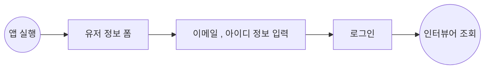
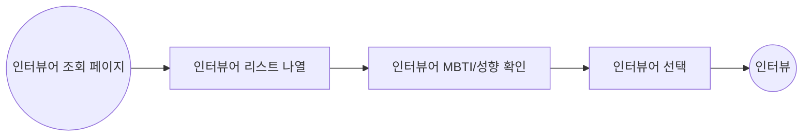
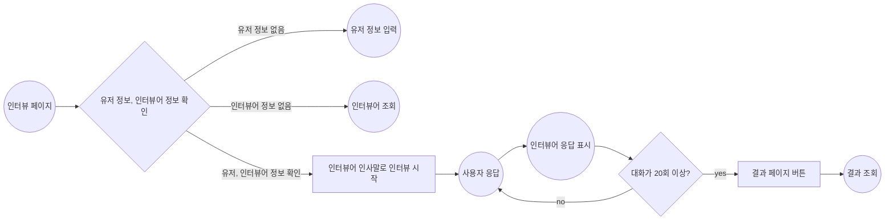
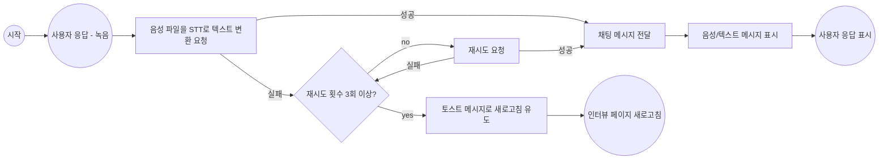
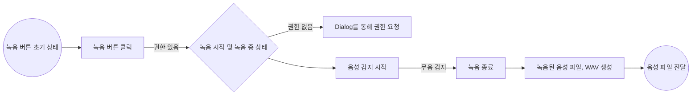
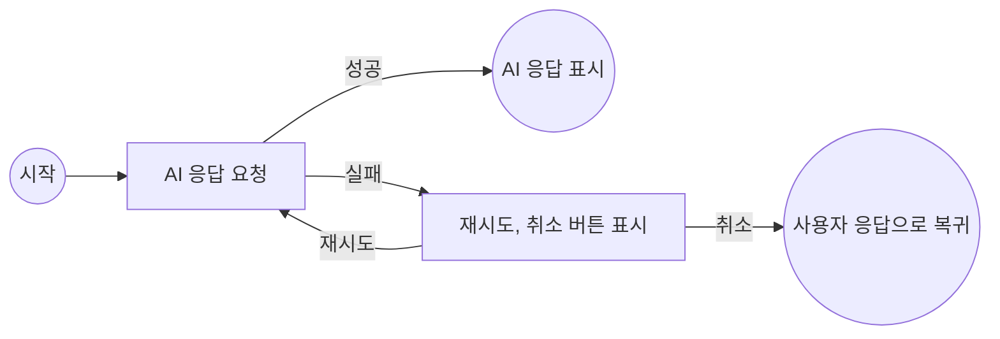
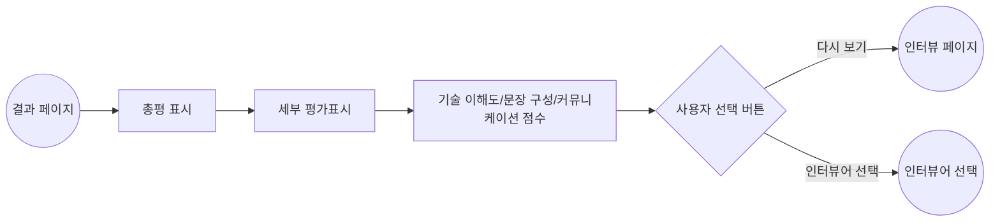

# InterPersona

InterPersona는 개발자들의 이직 준비, 현업에서 면접 연습을 효율적으로 할 수 있도록 돕는 웹 앱입니다.
ChatGPT의 프롬프트를 활용하여 가상의 면접관과 모의 면접을 진행하고, 결과를 점수로 평가 받을 수 있습니다.
또한 녹음을 통해서 답변하여 실제 면접과 같은 경험을 제공합니다.

## Tech Stack

Next.js (v.14) | React (v.18) | TypeScript | Turborepo | Storybook | CSS Modules | MSW | Redux Toolkit | Redux-Saga | Zustand | Jest | React Testing Library

## 상태관리

- Redux Toolkit, Redux-Saga: 채팅 기능 전용 상태관리로, 채팅 로직의 일정한 흐름의 안정성을 위해 적용
- Zustand: 전역에서 사용되는 상태 관리를 위해 적용

## UI

- 모노레포 프로젝트 구조로, @repo/ui 패키지로 분리하여 공통 컴포넌트 및 global style을 구성
- Storybook으로 repo/ui와 apps/frontend의 스타일링을 확인할 수 있도록 구성
- module css를 통해 Next JS의 서버 컴포넌트에 적합하도록 구성

## Build System

- 터보레포를 활용하여, 프로젝트를 여러 패키지 형태로 나누는 모노레포로 구성

## Test Tool

- React-testing-library, Jest를 통해 주요 로직의 테스트를 작성
- MSW를 통해 통신 테스트 모킹에 활용

# Flow Chart

## 유저 정보 입력

## 인터뷰어 조회

## 인터뷰

### 인터뷰 전체

### 사용자 응답

### 사용자 응답 - 녹음

### 인터뷰어 응답

## 면접관 결과

